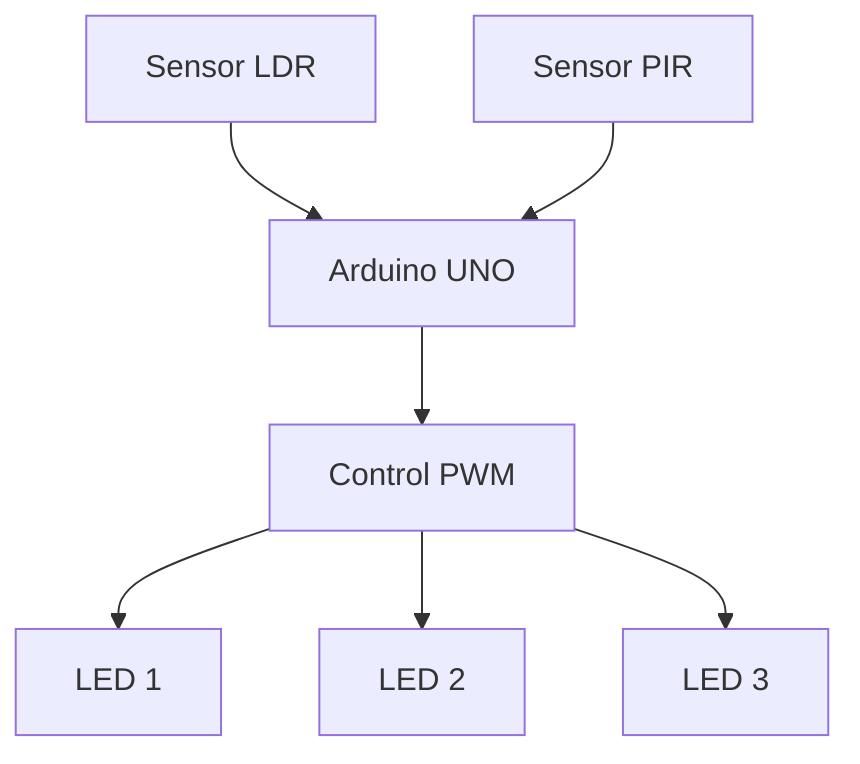

# 💡 Sistema Inteligente de Alumbrado Público de Bajo Consumo

<div align="center">

# 🌙 Smart Public Lighting System

### Sistema embebido inteligente para optimización energética ⚡


</div>

<div align="center">

</div>

<p align="center">
<a href="#"></a>
<a href="#"></a>
<a href="#"></a>
<a href="#"></a>
</p>

---

# 📍 Atajos del README

| TEMA              | DESCRIPCIÓN                     | ATAJO                                  |
| ----------------- | ------------------------------- | -------------------------------------- |
| 💻 Descripción    | Información general del sistema | [Ver](#-descripción)                   |
| 🎯 Objetivos      | Objetivos del proyecto          | [Ver](#-objetivos-del-sistema)         |
| 🏗️ Arquitectura  | Estructura y funcionamiento     | [Ver](#️-arquitectura-del-sistema)     |
| 🧰 Tecnologías    | Hardware y software utilizados  | [Ver](#-tecnologías-utilizadas)        |
| ⚙️ Funcionamiento | Lógica inteligente del sistema  | [Ver](#️-funcionamiento-del-sistema)   |
| 🔌 Componentes    | Componentes electrónicos        | [Ver](#-componentes-utilizados)        |
| 🧠 Modularidad    | División modular del sistema    | [Ver](#-modularidad-del-sistema)       |
| 🌙 Estados        | Estados de operación            | [Ver](#-estados-del-sistema)           |
| 🔄 Cocreación     | Integración hardware/software   | [Ver](#-cocreación-hardware--software) |
| 🚀 Implementación | Integración y conexiones        | [Ver](#-implementación-del-sistema)    |
| 🧪 Validación     | Pruebas y verificación          | [Ver](#-verificación-y-validación)     |
| 💻 Código Fuente  | Acceso al código Arduino        | [Ver](#-código-fuente)                 |

---

# 💻 Descripción

El proyecto consiste en un sistema embebido de alumbrado público inteligente, el cual es capaz de optimizar el consumo energético mediante el control automático de iluminación.

El sistema utiliza: 

* 🌙 Sensor LDR para detectar día y noche.
* 🚶 Sensor PIR para detección de movimiento.
* 💡 LEDs controlados mediante PWM.
* 🧠 Arduino UNO como unidad principal de procesamiento.

El objetivo principal es reducir el consumo eléctrico y la contaminación lumínica manteniendo niveles adecuados de iluminación únicamente cuando sea necesario.

---

# 🎯 Objetivos del sistema

## 🎯 Objetivo General

Diseñar un prototipo de alumbrado público inteligente que optimice el consumo energético mediante el control automático de la intensidad lumínica en función de las condiciones ambientales y la detección de presencia.

---

## 📌 Objetivos Específicos

* Implementar detección automática de luz ambiental.
* Controlar intensidad lumínica mediante PWM.
* Detectar movimiento utilizando sensor PIR.
* Automatizar el comportamiento del sistema.
* Reducir el consumo energético.
* Validar el funcionamiento en diferentes escenarios.

---

# 🏗️ Arquitectura del sistema

<div align="center">



</div>

---

## 🔹 Características de la arquitectura

* Sistema embebido en tiempo real.
* Control automático de iluminación.
* Integración hardware/software.
* Arquitectura modular.
* Bajo consumo energético.
* Respuesta automática basada en sensores.

---

# 💻🌐 Tecnologías utilizadas

## 💻 Software

* 🔹 Lenguaje C/C++
* 🔹 Arduino IDE
* 🔹 Tinkercad
* 🔹 PWM (Pulse Width Modulation)

---

## 🔌 Hardware

* 🔹 Arduino UNO R3
* 🔹 Sensor LDR
* 🔹 Sensor PIR
* 🔹 LEDs
* 🔹 Protoboard
* 🔹 Cables Jumpers

---

# ⚙️ Funcionamiento del sistema

El sistema trabaja de forma automática según las condiciones del entorno.

---

## ☀️ Estado Día

* Los LEDs permanecen apagados.
* Se evita consumo innecesario de energía.

```cpp
if (!esNoche) {
    apagarLEDs();
}
```

---

## 🌙 Estado Noche

* Los LEDs se encienden con brillo reducido.
* Se utiliza PWM para ahorrar energía.

```cpp
ajustarBrillo(brilloBajo);
```

---

## 🚶 Movimiento Detectado

* El sensor PIR detecta presencia.
* Los LEDs aumentan automáticamente al máximo brillo.

```cpp
ajustarBrillo(brilloAlto);
```

---

## ⏳ Temporizador Inteligente

El sistema utiliza `millis()` para mantener iluminación alta durante un tiempo determinado sin bloquear la ejecución.

```cpp
if (millis() - tiempoInicioMovimiento > duracionEncendido) {
    modoAlto = false;
}
```

---

# 🔌 Componentes utilizados

| Componente  | Función                        |
| ----------- | ------------------------------ |
| Arduino UNO | Procesamiento principal        |
| Sensor LDR  | Detectar iluminación ambiental |
| Sensor PIR  | Detectar movimiento            |
| LEDs PWM    | Simular alumbrado público      |
| Protoboard  | Integración electrónica        |
| Jumpers     | Conexiones eléctricas          |

---

# 🧠 Modularidad del sistema

## 🔹 Módulo 1: Lectura de luz

* Detecta nivel de iluminación.
* Determina día o noche.

---

## 🔹 Módulo 2: Detección de movimiento

* Detecta presencia mediante PIR.

---

## 🔹 Módulo 3: Control de iluminación

* Ajusta brillo utilizando PWM.

---

## 🔹 Módulo 4: Temporizador

* Controla el tiempo de iluminación máxima.

---

## 🔹 Módulo 5: Control lógico

* Coordina el comportamiento general del sistema.

---

# 🌙 Estados del sistema

| Estado        | Comportamiento      |
| ------------- | ------------------- |
| ☀️ Día        | LEDs apagados       |
| 🌙 Noche      | LEDs al brillo bajo |
| 🚶 Movimiento | LEDs al 100%        |

---

# 🔄 Cocreación Hardware + Software

El sistema funciona gracias a la integración entre hardware y software.

| Hardware             | Software        | Resultado           |
| -------------------- | --------------- | ------------------- |
| Sensor LDR           | `analogRead()`  | Detectar día/noche  |
| Sensor PIR           | `digitalRead()` | Detectar movimiento |
| LEDs PWM             | `analogWrite()` | Control de brillo   |
| Temporizador Arduino | `millis()`      | Tiempo automático   |

---

# 🚀 Implementación del sistema

## 🔧 Integración realizada

* Conexión física en protoboard.
* Simulación virtual en Tinkercad.
* Programación en Arduino IDE.
* Control automático mediante sensores.
* Integración PWM + PIR + LDR.

---

## 🔌 Conexiones principales

| Pin | Función    |
| --- | ---------- |
| A0  | Sensor LDR |
| 2   | Sensor PIR |
| 9   | LED PWM 1  |
| 10  | LED PWM 2  |
| 11  | LED PWM 3  |

---

# 🧪 Verificación y Validación

## ✔️ Verificación

* Funcionamiento correcto del circuito.
* Lectura adecuada de sensores.
* PWM operativo correctamente.

---

## ✔️ Validación

* Cumplimiento de objetivos planteados.
* Reducción del consumo energético.
* Respuesta automática correcta.

---

# ⚡ Optimización energética

El sistema implementa estrategias de ahorro energético como:

* Encendido inteligente.
* Uso de PWM.
* Iluminación adaptativa.
* Detección automática de presencia.
* Apagado automático durante el día.

---

# 🌍 Beneficios del sistema

* ⚡ Reducción del consumo eléctrico.
* 🌱 Disminución de contaminación lumínica.
* 💰 Menor costo energético.
* 🤖 Automatización inteligente.
* 🔋 Mayor eficiencia operativa.

---

# 📚 Metodología utilizada

El proyecto fue desarrollado siguiendo cuatro fases principales:

1. 📋 Especificación y modelado.
2. 🛠️ Diseño hardware/software.
3. 🔌 Implementación e integración.
4. 🧪 Verificación y validación.

---

# 🚀 Estado del proyecto

✅ Sistema funcional
✅ Simulación virtual completada
✅ Implementación física realizada
✅ Validación de funcionamiento completada

---

# 💻 Código Fuente

El código completo del sistema embebido desarrollado en Arduino se encuentra disponible en el siguiente enlace:

<div align="center">

## 🔗 [Ver Código Arduino](https://github.com/diegoih23/Proyecto-Alumbrado-P-blico-de-Bajo-Consumo/blob/main/Alumbrado%20P%C3%BAblico%20de%20Bajo%20Consumo.ino)

</div>

### 📌 Funcionalidades implementadas

* Lectura del sensor LDR mediante `analogRead()`
* Detección de movimiento con sensor PIR.
* Control de brillo utilizando PWM.
* Temporizador inteligente con `millis()`
* Encendido automático según condiciones ambientales.
* Optimización energética automática.


# 👨‍💻 Desarrolladores

<div align="center">

| Integrantes      |
| ---------------- |
| Ariana Cordova   |
| Ariel Tandazo    |
| Marco Castillo   |
| Wagner Balcazar  |
| Juan Veintimilla |

</div>

---

# 🏫 Universidad

### 🎓 Universidad Nacional de Loja

Loja - Ecuador 🇪🇨

---

# ⭐ ¡Apoya este proyecto!

<div align="center">

Si te gustó este proyecto puedes darle una ⭐ al repositorio.


</div>
